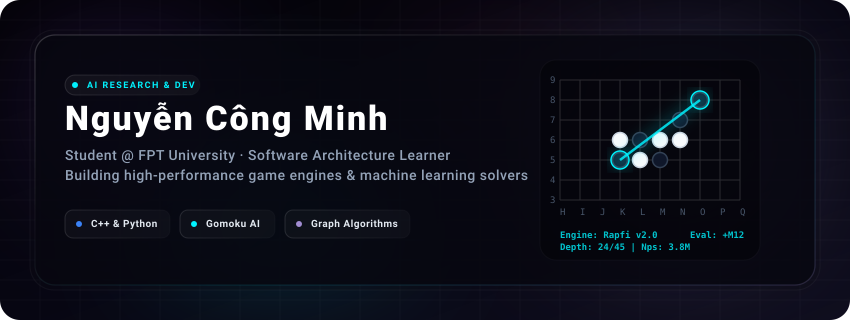
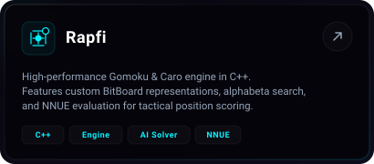
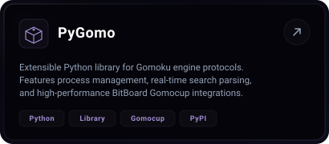
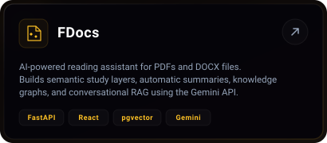
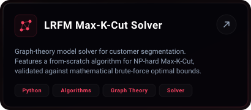

  

  
  

---

### 🧭 About me

  🛠️ <b>Background</b>: Software Engineering student at <b>FPT University</b>, actively building foundations in Software Architecture and High-Performance Systems. 
  🔬 <b>Research</b>: Aspiring AI Researcher interested in neural valuation systems, algorithmic complexity, and heuristic engines. 
  🐍 <b>Core Stack</b>: Specialized in high-performance <b>C++</b> and modern <b>Python</b> development. Building everything from scratch solver engines to full-stack microservices. 
  📍 <b>Based in</b>: Vietnam

---

### 🚀 Featured projects

  <!-- Row 1 -->
  
  

  <!-- Row 2 -->
  
  

---

### 🧰 Tech & tools

  
  
  
  
  
  
  

---

### 📫 Reach me

  
  

<i>⭐ Crafted with high-end glassmorphic details by <a href="https://github.com/nguyencongminh090">nguyencongminh090</a></i>

